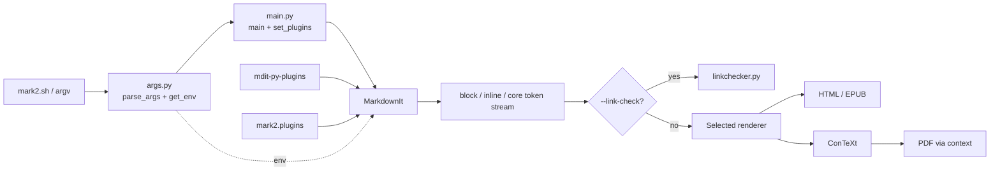
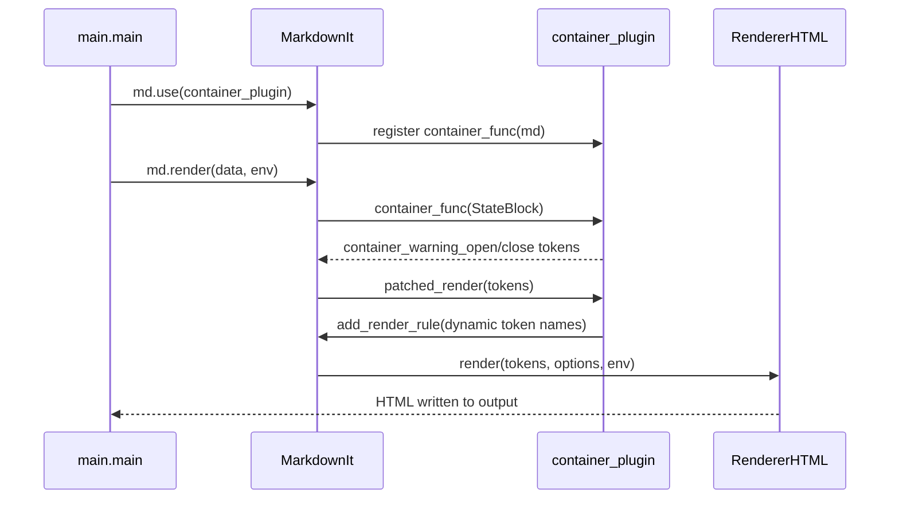
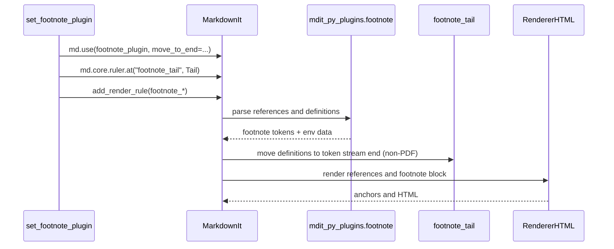

# Analisi architetturale di Mark2

## 1. Executive Summary

Mark2 è un convertitore Markdown da riga di comando. Il percorso principale è:

`mark2.sh -> mark2.main.main -> argparse -> MarkdownIt -> plugin/rule chain -> renderer -> file o stdout`.

Il componente centrale non è un plugin manager applicativo, ma l'istanza `MarkdownIt`. Mark2 configura questa istanza con una combinazione di plugin esterni (`mdit_py_plugins`) e plugin locali (`mark2.plugins`), quindi passa il testo e un dizionario `env` al parser/renderizzatore.

Nel codice esaminato non sono presenti discovery automatica, entry points Python, `importlib`, registry di plugin, dependency injection, message bus o eventi applicativi. I plugin sono importati staticamente in `mark2.main` e registrati in ordine fisso da `set_plugins`. Il loro contratto è una funzione/callable che riceve `MarkdownIt` e aggiunge regole alle catene di parsing o al renderer.

Esistono tuttavia due forme di dinamismo interne a `MarkdownIt`:

- `container_plugin` accetta nomi di container arbitrari nell'input e crea token `container_<nome>_open/close`.
- il renderer del container installa regole di rendering al momento del rendering dei token.

Il risultato è un'architettura modulare e facilmente testabile a livello di parser, ma con estensione a livello di codice sorgente: aggiungere un plugin di produzione richiede import e registrazione espliciti in `main.py`.

**Stato delle conclusioni:** le affermazioni operative seguenti sono verificate leggendo il codice e i test. Le osservazioni indicate come deduzione derivano dal fatto che non è stato trovato un percorso alternativo nel repository.

## 2. Struttura del progetto

### Directory e package

| Area                          | Contenuto                                    | Ruolo                                         |
| ----------------------------- | -------------------------------------------- | --------------------------------------------- |
| `src/mark2/`                  | package principale                           | CLI, argomenti, link checker                  |
| `src/mark2/plugins/`          | plugin e parser locali                       | estensioni della pipeline `MarkdownIt`        |
| `src/mark2/renderer/`         | renderer HTML, EPUB, PDF, ConTeXt e Markdown | consumo dei token e produzione dell'output    |
| `src/mark2/renderer/context/` | renderer ConTeXt e header A4/A5              | output TeX/ConTeXt                            |
| `src/mark2/renderer/epub/`    | packaging EPUB, cover, frontpage, immagini   | output EPUB                                   |
| `tests/mark2/`                | test unitari per package                     | comportamento di CLI, plugin e renderer       |
| `tests/spec/`                 | test di specifica                            | test opt-in con `--spec`                      |
| `tests/assets/`               | Markdown e asset di prova                    | fixture per i flussi end-to-end               |
| `doc/`                        | documentazione dei plugin                    | descrizione di alcune estensioni              |
| `mark2.sh`                    | script di avvio                              | imposta `PYTHONPATH=./src` e invoca `main.py` |

### Entry point e configurazione

- Entry point operativo: `src/mark2/main.py:main` (`if __name__ == "__main__"`).
- Launcher: `mark2.sh`.
- CLI: `src/mark2/args.py:configure_parser`, `parse_args`, `get_env`.
- Configurazione di progetto osservabile: `.pylintrc`, `.gitignore`; non è presente un file `pyproject.toml`, `setup.py` o `requirements.txt` nel tree esaminato.
- Dipendenze importate: `markdown-it-py`, `mdit-py-plugins` e, per alcune operazioni, il comando esterno ConTeXt (`context`). Il link checker usa solo la libreria standard (`urllib`); EPUB usa `zipfile`, file temporanei e gli helper locali.

## 3. Architettura logica

### Application / CLI

`main.main` orchestra il caso d'uso: legge gli argomenti, costruisce `env`, legge il Markdown, seleziona il renderer, configura il parser e avvia parsing/rendering. Non possiede un oggetto application persistente né un container di servizi.

### Parsing e plugin system

`MarkdownIt("commonmark", renderer_cls=...)` contiene:

- rule chain block per strutture a blocchi;
- rule chain inline per ruoli, superscript e Markdown inline;
- core rule chain per trasformazioni post-parse, tra cui gli heading ID e la coda delle footnote;
- mapping delle render rule del renderer.

I plugin locali sono funzioni di registrazione, non oggetti con stato o classi base.

### Renderer

La scelta è fatta in `main`:

- `HTMLRenderer` per HTML;
- `EPUBRenderer` per EPUB;
- `PDFRenderer` per PDF, con passaggio intermedio ConTeXt;
- `ConTeXtRenderer` e `MDRenderer` sono implementati ma non tutti sono esposti dalla CLI attuale;
- `ReferenceRenderer` è selezionabile dal flag nascosto `--reference`.

`RendererHTML` estende `markdown_it.renderer.RendererHTML` e implementa le regole HTML specifiche per front matter e footnote. `BaseRenderer` costruisce invece il proprio mapping di metodi-regola tramite introspezione e fallisce con `sys.exit(1)` su token non gestiti, salvo debug.

### Servizio opzionale di link checking

Con `--link-check`, `main` crea comunque un parser e registra i plugin, esegue `md.parse`, poi passa i token a `linkchecker.check_all_links`. Non viene invocato il renderer. URL relativi e ancore interne sono classificati senza rete; HTTP/HTTPS/FTP vengono verificati tramite `urllib`.

## 4. Componenti principali

| Componente                  | Responsabilità                           | Dipendenze principali                          | Utilizzato da                 |
| --------------------------- | ---------------------------------------- | ---------------------------------------------- | ----------------------------- |
| `main.py`                   | orchestrazione CLI e pipeline            | `args`, renderer, plugin package, `MarkdownIt` | launcher e test main          |
| `args.py`                   | parsing/validazione argomenti e `env`    | `argparse`, `argparsext`                       | `main`                        |
| `plugins/__init__.py`       | riesporta plugin locali                  | moduli plugin                                  | `main`, test                  |
| `container_plugin.py`       | token block generici dinamici            | rule block MarkdownIt                          | `main`, renderer              |
| `myst_role_plugin.py`       | token inline MyST                        | rule inline e render rule                      | `main`, renderer              |
| `headingsid_plugin.py`      | ID univoci sugli heading                 | core rule chain                                | `main`, renderer EPUB/ConTeXt |
| `pagebreak_plugin.py`       | token `pagebreak` da `---`               | rule block e renderer                          | `main`, renderer              |
| `sup_plugin.py`             | token `sup_open/close`                   | rule inline e renderer                         | `main`, renderer              |
| `footnote_plugin.py`        | spostamento token footnote               | stato `env`, core rule                         | `main`                        |
| `yaml_parser.py`            | subset di front matter YAML              | libreria standard                              | renderer                      |
| `rendererhtml.py`           | rendering HTML di token custom           | `parse_simple_yaml`                            | HTML/EPUB renderer            |
| `baserenderer.py`           | rendering imperativo per output testuali | introspezione, YAML parser                     | ConTeXt/MD                    |
| `renderer/epub/renderer.py` | archivio EPUB e TOC                      | `zipfile`, helper EPUB                         | `main`                        |
| `renderer/pdf.py`           | compilazione TeX in PDF                  | `subprocess`, `context`                        | `main`                        |

## 5. Dipendenze e relazioni

Le relazioni più importanti sono:

- `mark2.sh -> main.main`: invocazione di processo e preparazione dell'import path.
- `main.main -> args.parse_args -> args.get_env`: argomenti CLI trasformati in `Namespace` e poi in `env`.
- `main.main -> MarkdownIt`: istanziazione del parser con la classe renderer selezionata.
- `main.set_plugins -> MarkdownIt.use`: registrazione diretta di plugin esterni e locali, inclusi `myst_block_plugin` e `pagebreak_plugin`.
- `container_plugin -> MarkdownIt.block.ruler`: inserisce `container_generic` prima di `fence`.
- `myst_role_plugin -> MarkdownIt.inline.ruler`: inserisce `myst_role` prima di `backticks` e registra `myst_role` nel renderer.
- `myst_block_plugin -> MarkdownIt.block.ruler`: registra i token block `myst_line_comment`, `myst_block_break` e `myst_target`; il plugin proviene da `mdit-py-plugins`.
- `headingsid_plugin -> MarkdownIt.core.ruler`: aggiunge una closure che muta gli attributi dei token `heading_open`.
- `pagebreak_plugin -> MarkdownIt.block.ruler`: inserisce `pagebreak` prima di `hr` e registra la render rule omonima.
- `sup_plugin -> MarkdownIt.inline.ruler`: inserisce `sup` dopo `emphasis` e registra `sup_open`/`sup_close`.
- `set_footnote_plugin -> mdit_py_plugins.footnote`: registra il parser esterno e, se richiesto, `footnote_tail` nella core chain.
- `RendererHTML -> yaml_parser.parse_simple_yaml`: il token front matter aggiorna `env["front_matter"]` e non produce HTML.
- `main --link-check -> linkchecker`: token già parsati diventano `LinkInfo`, poi richieste di rete o classificazioni locali.
- `PDFRenderer -> ConTeXtRenderer -> subprocess.run(["context", ...])`: il testo intermedio viene compilato da un programma esterno.

Non risultano chiamate tra plugin locali come unità. La comunicazione è indiretta tramite token, rule chain, renderer ed `env`.

## 6. Flusso di esecuzione

1. `mark2.sh` esporta `PYTHONPATH=./src` e invoca `src/mark2/main.py`.
2. `main` chiama `parse_args`. Il parser valida estensione input/output, formato e opzioni specifiche.
3. `get_env` crea un dizionario con file, formato, flag debug/quiet e opzioni EPUB/PDF.
4. `read_data` legge il file o `stdin`.
5. Se è attivo `--link-check`, viene creato un `MarkdownIt` commonmark, vengono registrati i plugin, si esegue `parse` e il flusso termina con il report.
6. Altrimenti `main` sceglie la classe renderer in base a `--reference` o `args.format`.
7. Viene creato `MarkdownIt("commonmark", renderer_cls=renderer_cls)`.
8. `set_plugins` abilita tabelle/strikethrough, plugin esterni e plugin locali, in ordine fisso. Le footnote ricevono `move_to_end=False` solo per PDF.
9. `md.render(data, env=env)` esegue parsing block/inline, core rules e renderer. I renderer scrivono direttamente nel file/output indicato in `env`; il valore restituito da `md.render` non viene usato da `main`.
10. EPUB crea un archivio temporaneo e lo copia all'output. PDF crea un `.tex` temporaneo e invoca `context`.

La configurazione non viene iniettata nei plugin durante l'istanziazione: i plugin ricevono solo `md`; `env` è disponibile in fase di parsing e rendering.

## 7. Sistema dei plugin

### 7.1 Individuazione

L'individuazione è statica. `main.py` importa esplicitamente i plugin e `set_plugins` li registra esplicitamente. `plugins/__init__.py` offre riesportazioni comode, ma non effettua scansioni.

Nel repository non sono presenti chiamate a `importlib`, `entry_points`, `pkg_resources`, naming convention di moduli, decorator di registrazione o classi `PluginManager`. Pertanto non è possibile installare un plugin esterno e aspettarsi che Mark2 lo carichi automaticamente: questa è una conclusione dedotta dall'assenza di un percorso di discovery alternativo nel codice.

### 7.2 Caricamento e registrazione

Il “caricamento” reale è import-time del modulo Python, seguito dalla registrazione su `MarkdownIt`:

1. import statico in `main.py`;
2. creazione del parser;
3. chiamata `md.use(plugin, **options)` oppure `md.enable`;
4. il plugin aggiunge regole a block, inline, core o renderer;
5. il parser usa tali regole quando `md.parse`/`md.render` viene chiamato.

Non esiste istanziazione di oggetti plugin. Un errore di import avviene prima della pipeline e blocca l'avvio; un errore nella callable plugin avviene durante `set_plugins` e viene propagato, salvo gestione esterna del processo.

### 7.3 Contratto

Il contratto verificato è una callable compatibile con l'API `MarkdownIt`, normalmente:

```python
def plugin(md: MarkdownIt, *options) -> None:
    md.block.ruler.before(...)
    md.inline.ruler.after(...)
    md.core.ruler.push(...)
    md.add_render_rule(...)
```

Non sono richiesti base class, Protocol, metodi `initialize`, `execute` o `shutdown`, né attributi identificativi. Le callback di parsing e rendering rispettano invece le firme dell'ecosistema `markdown-it-py`: ricevono stato parser oppure `(renderer, tokens, idx, options, env)`.

### 7.4 Plugin presenti

| Plugin                               | Punto di estensione      | Token/regole                                | Renderer o effetto                                        |
| ------------------------------------ | ------------------------ | ------------------------------------------- | --------------------------------------------------------- |
| `attrs_block_plugin` (esterno)       | block                    | attributi sui blocchi                       | renderer standard                                         |
| `front_matter_plugin` (esterno)      | block                    | `front_matter`                              | `RendererHTML.front_matter` / `BaseRenderer.front_matter` |
| `sub_plugin` (esterno)               | inline                   | `sub_open/close`                            | renderer standard o ConTeXt                               |
| `container_plugin`                   | block e render dinamico  | `container_<name>_open/close`               | div/classi HTML, supporto custom nei renderer             |
| `sup_plugin`                         | inline                   | `sup_open/close`                            | `<sup>` o `\high{}`                                       |
| `headingsid_plugin`                  | core                     | mutazione `heading_open.attrs`              | HTML/EPUB/ConTeXt usano l'ID                              |
| `myst_role_plugin`                   | inline/render            | `myst_role`                                 | `<span class="name">...</span>` o gestione ConTeXt        |
| `pagebreak_plugin`                   | block/render             | `pagebreak`                                 | `<hr class="pagebreak" />` o `\page`                      |
| `myst_block_plugin` (esterno)        | block/render             | commenti, `myst_block_break`, `myst_target` | HTML e token MyST                                         |
| `footnote_plugin` (esterno + custom) | block/inline/core/render | footnote tokens                             | regole HTML custom; coda opzionale                        |

`myst_block_plugin`, importato da `mdit_py_plugins.myst_blocks`, implementa commenti `%`, break `+++` e target `(name)=` ed è registrato da `main.set_plugins`. La documentazione in `doc/myst_block_plugin.md` descrive quindi una capacità attiva nel percorso CLI corrente. I token MyST block hanno renderizzazione HTML fornita dal plugin; i renderer basati su `BaseRenderer` non definiscono regole dedicate per questi token.

## 8. Plugin lifecycle

Il lifecycle applicativo completo richiesto da un plugin manager non esiste. Le fasi reali sono:

1. **Import:** caricamento statico dei moduli Python.
2. **Registration:** `md.use` e `md.add_render_rule` durante `set_plugins`.
3. **Parsing:** callback block/inline producono token.
4. **Core processing:** callback come `_anchor_func` o `footnote_tail` modificano il token stream.
5. **Rendering:** render rule del renderer consumano token e `env`.
6. **Fine richiesta:** il parser e il renderer sono oggetti locali a `main`; non esiste `unload` o `shutdown`.

Non esistono fasi separate di discovery, validation, instantiation, dependency injection, initialization o unloading. La validazione è locale alle singole regole di parsing: per esempio il container rifiuta meno di tre marker e il ruolo MyST rifiuta nomi/content non validi.

## 9. Comunicazione Plugin ↔ Core

### Core -> plugin

Il core (`MarkdownIt`) invoca le callback registrate nella propria rule chain. Passa:

- `StateBlock` alle regole block;
- `StateInline` alle regole inline;
- `StateCore` alle core rule;
- renderer, lista token, indice, opzioni ed `env` alle render rule.

Esempio: `headingsid_plugin` riceve `StateCore`, trova gli heading e muta il token di apertura; il renderer vede poi l'attributo `id` già presente.

### Plugin -> core

Il plugin non chiama un servizio applicativo. Durante la registrazione muta i registri pubblici di `MarkdownIt` (`block.ruler`, `inline.ruler`, `core.ruler`, `renderer.rules`) e durante l'esecuzione crea token tramite `state.push` o modifica `state.tokens`.

### Env e dati condivisi

`env` è un dizionario condiviso per una singola renderizzazione. `args.get_env` inserisce le opzioni CLI; il front matter inserisce `front_matter`; il plugin footnote legge `env["footnotes"]`; renderer e plugin custom possono leggere questi dati. Questo è un contesto condiviso, non un sistema DI tipizzato.

## 10. Comunicazione tra plugin

Non risultano API per chiamare un plugin da un altro, dipendenze dichiarate, ordine risolvibile o eventi tra plugin. Le interazioni osservabili sono indirette:

- `set_footnote_plugin` combina il parser footnote esterno, `footnote_tail` locale e le render rule di `RendererHTML`;
- heading ID produce attributi consumati dal renderer EPUB per TOC e dal renderer ConTeXt per target;
- container produce token consumati dal renderer standard o da logica dinamica del renderer.

Queste non sono dipendenze tra istanze plugin, ma cooperazione sul token stream e sull'API MarkdownIt. Se una callable richiesta in `set_plugins` non è importabile o fallisce, l'inizializzazione dell'intera conversione fallisce; non esiste isolamento o disabilitazione del singolo plugin.

## 11. Configurazione

La configurazione segue il percorso:

`argv -> parse_args -> Namespace -> get_env -> MarkdownIt.render(..., env=env) -> renderer/plugin`.

Le opzioni EPUB e PDF sono validate in `args.validate_args` e copiate in `env` solo per il formato interessato. I plugin hanno pochi parametri diretti: `headingsid_plugin` riceve `min_level=1, max_level=6`, mentre il footnote plugin riceve `move_to_end` in base al formato.

Il front matter è una seconda sorgente di configurazione del documento. Il plugin esterno produce un token; il renderer HTML o `BaseRenderer` chiama `parse_simple_yaml` e memorizza il risultato in `env["front_matter"]`. Il parser locale supporta un subset YAML, coercizione di bool/numeri e scalari `|`/`>`; non è una validazione di schema.

Non risultano configurazione live, reload, default per-plugin centralizzati o associazione automatica tra una sezione di configurazione e un plugin.

## 12. Error handling

| Caso                                | Comportamento verificato                                                                     |
| ----------------------------------- | -------------------------------------------------------------------------------------------- |
| file input inesistente/non valido   | errore di apertura o validazione CLI, propagato da `argparse`/filesystem                     |
| plugin/module non importabile       | errore durante import, avvio interrotto                                                      |
| errore in `set_plugins`             | propagato, nessun fallback                                                                   |
| sintassi non riconosciuta           | la regola restituisce `False`, MarkdownIt prova le regole successive                         |
| front matter malformato             | `parse_simple_yaml` solleva `ValueError`                                                     |
| token non gestito da `BaseRenderer` | messaggio stderr e `sys.exit(1)`, salvo debug; nel codice il messaggio è `[UNHANDLED TOKEN]` |
| comando `context` assente           | `PDFRenderer` stampa errore e termina con codice 1                                           |
| compilazione ConTeXt fallita        | stderr del processo, uscita 1                                                                |
| PDF non generato                    | messaggio stderr, uscita 1                                                                   |
| link HTTP non valido                | `LinkInfo.status` diventa `invalid`/`error`; il report porta a exit code 1                   |
| link relativo o anchor interno      | classificato senza richiesta di rete                                                         |

Una parte del rendering HTML delega a `markdown-it-py`, mentre i renderer basati su `BaseRenderer` trattano i token sconosciuti come errore fatale. Gli errori di un plugin non vengono trasformati in stato “disabled”.

## 13. Punti di estensione

1. **Nuovo parser/plugin MarkdownIt.** Implementare una callable `plugin(md)`, aggiungere rule block/inline/core e render rule, importarla in `main.py` e registrarla in `set_plugins`. Per output multipli occorre aggiungere il metodo corrispondente ai renderer che non delegano al renderer HTML.
2. **Nuova sintassi block/inline.** Inserire la regola con `before`/`after` in una posizione coerente con la precedenza MarkdownIt e produrre token con un nome stabile.
3. **Nuova trasformazione core.** Aggiungere una callback a `md.core.ruler`, come fa `headingsid_plugin`; il risultato deve essere visibile ai renderer successivi.
4. **Nuova rappresentazione d'output.** Creare una classe renderer e selezionarla in `main`; se usa `BaseRenderer`, implementare ogni token necessario.
5. **Nuova configurazione CLI.** Aggiungere opzione in `args.configure_parser`, validazione in `validate_args` e valore in `get_env`; il renderer/plugin deve poi leggerlo da `env`.
6. **Container custom.** Usare `container_plugin` con una funzione `render` o implementare un renderer che gestisca i token `container_*`. Il nome è preso dall'input e diventa classe/token, quindi il consumer deve gestire nomi dinamici.

Il punto centrale da aggiornare per un plugin attivo è `main.set_plugins`; esportarlo soltanto da `plugins/__init__.py` non basta.

## 14. Esempio completo: `container_plugin`

Input:

```markdown
::: warning
Testo con **grassetto**.
:::
```

Percorso reale:

1. `main.set_plugins` chiama `md.use(container_plugin)`.
2. `container_plugin` registra `container_func` prima della regola `fence`.
3. In parsing, `container_func` verifica marker, lunghezza minima e nome non vuoto; poi crea `container_warning_open` e `container_warning_close` e delega il contenuto a `state.md.block.tokenize`.
4. Il contenuto interno passa nuovamente dalle regole MarkdownIt e produce, per esempio, `paragraph_open`, `inline` e `paragraph_close`.
5. Il plugin salva il render callback in `md._container_render` se non presente e sostituisce `md.renderer.render` con `patched_render`.
6. Al rendering, `patched_render` osserva i token `container_warning_open/close` e aggiunge regole dinamiche con `md.add_render_rule`.
7. Il renderer standard invoca `renderDefault`, che aggiunge `class="warning"` al token di apertura e delega a `renderToken`.
8. Con `RendererHTML` il risultato è un `div` HTML contenente il paragrafo. Nei renderer ConTeXt legacy la logica `container_open/container_close` può tradurre i token in `framedtext`; l'implementazione attiva ConTeXt usa i metodi della propria classe e non una discovery del container.
9. Non esiste una fase di disattivazione: il parser viene abbandonato al termine della conversione. Per evitare il plugin occorre non chiamare `set_plugins` o modificare il codice di registrazione.

Questo esempio dimostra che il dinamismo è sui nomi dei token e delle classi del documento, non sul caricamento di moduli Python.

## 15. Diagrammi Mermaid

### Diagramma architetturale



### Caricamento dei plugin

```mermaid
flowchart LR
    Application[main.main] --> Imports[static imports in main.py]
    Imports --> Parser[MarkdownIt(renderer_cls)]
    Parser --> Register[set_plugins]
    Register --> Rules[MarkdownIt rule chains\nblock / inline / core / renderer]
    Rules --> Parse[md.parse or md.render]
    Parse --> TokenStream[Token stream]
    TokenStream --> Render[Renderer]
```

### Interazione Core -> Plugin -> Core



### Footnote e core rule



## 16. Valutazione architetturale

### Aspetti positivi

- Separazione leggibile tra CLI, parsing, plugin e output.
- Plugin piccoli e composabili grazie all'API rule-chain di `MarkdownIt`.
- Test unitari diretti: ogni plugin può essere registrato su un parser minimale e verificato sull'HTML prodotto.
- Supporto multi-output ottenuto riusando lo stesso token stream.
- Container dinamici e MyST roles permettono estensioni del contenuto senza registry applicativi.
- La configurazione per una singola conversione è esplicita nell'`env`, evitando stato globale persistente tra invocazioni.

### Criticità motivate dal codice

- **Accoppiamento dell'orchestrazione:** l'elenco e l'ordine dei plugin sono hard-coded in `main.set_plugins`; non c'è un confine che consenta di aggiungerli senza modificare il core.
- **Contratto implicito:** l'API plugin è una convenzione su callable, token name e firme MarkdownIt; non esiste un Protocol o una validazione preventiva.
- **Error isolation assente:** import, registrazione e callback possono interrompere l'intera conversione; non esiste stato per-plugin.
- **Dipendenza dai token stringa:** renderer e link checker distinguono token tramite stringhe; rinominare un token può produrre errori solo a runtime.
- **Patch del renderer nei container:** `container_plugin` sostituisce `md.renderer.render`, una tecnica potente ma più fragile rispetto a una render rule stabile, soprattutto se combinata con altri plugin che patchano lo stesso metodo.
- **Configurazione non tipizzata:** `env` è un dizionario mutabile; chiavi errate o valori incompatibili non vengono generalmente rilevati in anticipo.
- **Divergenza tra capacità dichiarate e attive:** README, documentazione dei plugin, rami renderer e opzioni CLI non sono perfettamente allineati (la CLI limita i formati a html/epub/pdf, mentre `main` contiene anche un ramo per `md`; `tex` è esposto dalla CLI ma richiede il renderer ConTeXt).
- **Output con effetti collaterali:** `main` ignora il valore di ritorno di `md.render`; i renderer scrivono direttamente su file/stdout. Questo rende meno semplice comporre la pipeline come libreria.
- **PDF con dipendenza di processo:** la funzionalità PDF richiede il binario `context` e termina il processo con `sys.exit` in caso di errore.

Questi punti sono rischi di manutenzione osservati nel codice, non raccomandazioni per introdurre necessariamente un framework di plugin.

## 17. Conclusioni

L'applicazione parte dalla CLI, costruisce un parser `MarkdownIt` e lo configura con un set fisso di plugin. Il “plugin system” è quindi un sistema di estensioni del parser, non un sistema di moduli caricabili a runtime. `MarkdownIt` gestisce registrazione ed esecuzione; `main.set_plugins` decide quali estensioni sono attive; i renderer trasformano i token in output.

Un plugin comunica con il core attraverso rule chain, token e `env`, non attraverso servizi iniettati o eventi. I plugin non hanno lifecycle autonomo, non comunicano direttamente tra loro e non vengono scaricati. Per aggiungere un plugin, lo sviluppatore deve implementare una callable compatibile, definire token/rule/rendering, importarla in `main.py`, registrarla nell'ordine desiderato e aggiungere test per ogni renderer rilevante.

## 18. Glossario

| Termine              | Significato nel progetto                                                         |
| -------------------- | -------------------------------------------------------------------------------- |
| `MarkdownIt`         | parser, rule engine, token stream e coordinatore del rendering                   |
| plugin               | callable che registra regole su un'istanza `MarkdownIt`                          |
| rule chain           | sequenza block, inline o core invocata dal parser                                |
| token                | unità intermedia prodotta dal parsing e consumata dal renderer                   |
| render rule          | callback associata a un tipo token                                               |
| `env`                | dizionario per-conversione con opzioni CLI, front matter e stato parser          |
| `front_matter`       | metadata iniziale del documento, convertito in `env["front_matter"]`             |
| `container_<name>_*` | token dinamici prodotti dal plugin container                                     |
| `footnote_tail`      | core rule locale che sposta le definizioni footnote in coda                      |
| renderer             | componente che traduce token in HTML, EPUB, PDF/ConTeXt o Markdown               |
| discovery            | meccanismo di ricerca automatica dei plugin; non presente in Mark2               |
| lifecycle            | sequenza plugin manager; in Mark2 è ridotta a registrazione, parsing e rendering |