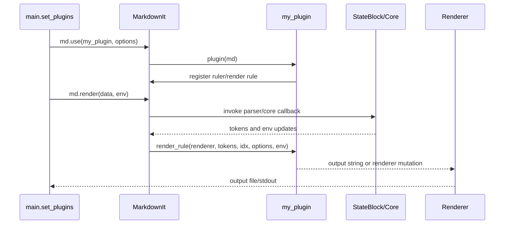
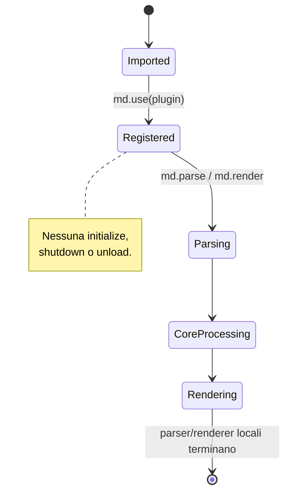

# Plugin Developer Guide

Questa guida completa [l'analisi architetturale](architecture.md) e cambia prospettiva: descrive come sviluppare, registrare, testare e diagnosticare un'estensione di Mark2.

## 1. Prima decisione: quale tipo di estensione serve?

In Mark2 un plugin è un'estensione di `MarkdownIt`, non un componente caricato da un plugin manager. Il punto di ingresso è una callable che riceve il parser:

```python
def my_plugin(md: MarkdownIt) -> None:
    ...
```

La callable viene importata e registrata in `src/mark2/main.py`, nella funzione `set_plugins`. Non esistono discovery automatica, entry points, classi base, metadata obbligatori, dependency injection, event bus o lifecycle `initialize`/`shutdown`.

Scegli il punto di estensione in base al problema:

| Obiettivo                      | API da usare                         | Esempio reale                             |
| ------------------------------ | ------------------------------------ | ----------------------------------------- |
| riconoscere un blocco          | `md.block.ruler.before/after`        | `pagebreak_plugin`                        |
| riconoscere inline             | `md.inline.ruler.before/after`       | `myst_role_plugin`, `sup_plugin`          |
| trasformare token già prodotti | `md.core.ruler.push/at`              | `headingsid_plugin`, `footnote_tail`      |
| renderizzare un token          | `md.add_render_rule(name, callback)` | `pagebreak_plugin`, `myst_role_plugin`    |
| abilitare una regola standard  | `md.enable(name)`                    | `table`, `strikethrough` in `set_plugins` |

La fonte definitiva è il codice. In particolare, il documento architetturale descrive `myst_block_plugin.py`, ma quel modulo non è importato né registrato da `set_plugins`: per renderlo attivo occorre aggiungerlo esplicitamente.

## 2. Plugin Contract

### Contratto minimo verificato

**Required**

- un modulo Python importabile dal processo;
- una callable passata a `MarkdownIt.use` oppure invocata durante la configurazione;
- una firma compatibile con `plugin(md: MarkdownIt) -> None`;
- registrazione esplicita in `src/mark2/main.py:set_plugins` per il percorso CLI;
- render rule per ogni token custom che deve essere emesso.

**Optional**

- opzioni della callable, come `headingsid_plugin(md, min_level, max_level)`;
- una funzione parser block/inline;
- una core rule;
- una o più render rule;
- test dedicati;
- una funzione di rendering diversa per formato.

Non sono richiesti:

- classe plugin;
- costruttore;
- `initialize`, `execute`, `shutdown`;
- `name`, versione o metadata;
- registry applicativo;
- logger o contesto fornito dal core.

### Metodi e callback importanti

#### Registration function

```text
Method:       my_plugin(md, ...options)
Location:     <plugin_module>.py
Required:     Sì, se il plugin viene registrato con md.use
Called by:    MarkdownIt.use, da main.set_plugins
Called when:  Durante la costruzione della pipeline, prima del parsing
Arguments:    MarkdownIt e opzioni del plugin
Returns:      Normalmente None
Can raise:    Qualsiasi eccezione della registrazione; viene propagata
Purpose:      Aggiungere parser rule, core rule e render rule
```

#### Block rule

```text
Method:       block_rule(state, start_line, end_line, silent)
Location:     modulo del plugin
Required:     Solo per un plugin block
Called by:    MarkdownIt durante il parsing block
Called when:  Il parser prova la posizione corrente
Arguments:    StateBlock, estremi delle righe, modalità di validazione
Returns:      bool; True se la regola ha consumato l'input
Can raise:    Eccezioni di parsing o di codice; non vengono isolate
Purpose:      Creare token con state.push e avanzare state.line
```

La regola deve restituire `False` quando la sintassi non corrisponde. In modalità `silent` deve solo validare, senza creare token: `pagebreak_rule` è il riferimento più semplice.

#### Inline rule

```text
Method:       inline_rule(state, silent)
Location:     modulo del plugin
Required:     Solo per sintassi inline
Called by:    MarkdownIt inline ruler
Called when:  Il cursore inline è sulla posizione corrente
Arguments:    StateInline e flag silent
Returns:      bool
Can raise:    Eccezioni non intercettate dal framework
Purpose:      Creare token inline e aggiornare state.pos
```

#### Core rule

```text
Method:       core_rule(state)
Location:     modulo del plugin
Required:     Solo per post-processing
Called by:    MarkdownIt core ruler
Called when:  Il parsing ha prodotto il token stream
Arguments:    StateCore
Returns:      None
Can raise:    Eccezioni non intercettate
Purpose:      Modificare token o env prima del rendering
```

#### Render rule

```text
Method:       render_rule(renderer, tokens, idx, options, env)
Location:     modulo del plugin oppure metodo del renderer
Required:     Sì per token custom
Called by:    Renderer durante md.render
Called when:  Viene incontrato il token registrato
Arguments:    renderer, token list, indice, options, env
Returns:      Stringa per RendererHTML; i renderer BaseRenderer mutano result e possono restituire None
Can raise:    Eccezioni di rendering; BaseRenderer può terminare con sys.exit per token non gestiti
Purpose:      Tradurre il token nell'output del formato corrente
```

## 3. Minimum Viable Plugin

Il plugin più piccolo utile e realmente compatibile è un plugin che riconosce `---` e usa una render rule HTML. È una versione ridotta e autonoma del plugin reale in `src/mark2/plugins/pagebreak_plugin.py`.

### Struttura

```text
src/mark2/plugins/
    pagebreak_plugin.py       # modulo del plugin
tests/mark2/plugins/
    test_pagebreak_plugin.py  # test del comportamento
```

### Codice minimo

```python
from collections.abc import Sequence

from markdown_it import MarkdownIt
from markdown_it.renderer import RendererProtocol
from markdown_it.rules_block import StateBlock
from markdown_it.token import Token
from markdown_it.utils import EnvType, OptionsDict


def page_marker_plugin(md: MarkdownIt) -> None:
    md.block.ruler.before("hr", "page_marker", page_marker_rule)
    md.add_render_rule("page_marker", render_page_marker)


def page_marker_rule(
    state: StateBlock, start_line: int, end_line: int, silent: bool
) -> bool:
    start = state.bMarks[start_line] + state.tShift[start_line]
    end = state.eMarks[start_line]
    if state.src[start:end].strip() != "---":
        return False
    if silent:
        return True

    token = state.push("page_marker", "", 0)
    token.markup = "---"
    token.map = [start_line, start_line + 1]
    state.line = start_line + 1
    return True


def render_page_marker(
    renderer: RendererProtocol,
    tokens: Sequence[Token],
    idx: int,
    options: OptionsDict,
    env: EnvType,
) -> str:
    return '<hr class="page-marker" />\n'
```

La funzione `page_marker_plugin` è obbligatoria per `md.use`; la block rule è necessaria per riconoscere input; la render rule è necessaria perché il token `page_marker` non appartiene alle regole standard.

### Registrazione nella CLI

In `src/mark2/main.py`:

```python
from mark2.plugins.page_marker_plugin import page_marker_plugin


def set_plugins(md: MarkdownIt, output_format: str | None = None) -> None:
    ...
    md.use(page_marker_plugin)
    ...
```

Questa modifica è indispensabile: creare il file non attiva il plugin. `plugins/__init__.py` può riesportare la funzione, ma il caricamento della CLI resta quello scritto in `set_plugins`.

## 4. Dal plugin minimo al plugin reale

### 4.1 Opzioni di registrazione

Le opzioni più semplici vengono passate a `md.use` e catturate durante la registrazione:

```python
def marker_plugin(md: MarkdownIt, marker_class: str = "page-marker") -> None:
    def render_marker(renderer, tokens, idx, options, env):
        return f'<hr class="{marker_class}" />\n'

    md.block.ruler.before("hr", "marker", marker_rule)
    md.add_render_rule("marker", render_marker)
```

Registrazione:

```python
md.use(marker_plugin, marker_class="chapter-break")
```

Questo è il modello usato concettualmente da `headingsid_plugin`, che riceve `min_level`, `max_level`, `use_title_based_ids` e `slug_func`.

### 4.2 Configurazione del documento e `env`

Durante `md.render(data, env=env)`, le render rule ricevono lo stesso dizionario. Per esempio:

```python
def render_marker(renderer, tokens, idx, options, env):
    css_class = env.get("marker_class", "page-marker")
    return f'<hr class="{css_class}" />\n'
```

Nel percorso CLI, l'`env` viene costruito in `src/mark2/args.py:get_env`. Per aggiungere una vera opzione CLI occorre modificare tutti e tre i punti:

```python
# args.py:configure_parser
parser.add_argument("--marker-class", default="page-marker")

# args.py:get_env
env["marker_class"] = args.marker_class

# plugin render rule
css_class = env.get("marker_class", "page-marker")
```

Se l'opzione vale solo per un formato, replicare il pattern EPUB/PDF di `get_env` e aggiungere una validazione in `validate_args`. Non esiste un namespace plugin automatico, schema, reload o validatore fornito da Mark2.

### 4.3 Logging

Il core non passa un logger al plugin. Un plugin può usare la libreria standard, ma deve configurarla senza aspettarsi servizi Mark2:

```python
import logging

logger = logging.getLogger(__name__)


def render_marker(renderer, tokens, idx, options, env):
    logger.debug("Rendering marker token at index %s", idx)
    return '<hr class="page-marker" />\n'
```

Il progetto usa inoltre `stderr` in alcuni renderer per debug/errori. Il flag `--debug` finisce in `env["debug"]`; `--debug-tokens` finisce in `env["debug_tokens"]`, ma non esiste un logger condiviso.

### 4.4 Accesso ai servizi e context

Non esiste un `PluginContext`, service container o API applicativa. Il plugin può accedere soltanto a:

- l'istanza `MarkdownIt` durante la registrazione;
- `StateBlock`, `StateInline` o `StateCore` durante il parsing;
- `renderer`, token, options ed `env` durante il rendering;
- moduli Python importati direttamente, se la funzionalità lo richiede.

Non aggiungere codice come `self.context.logger`, `core.services` o `plugin_manager`: non sono oggetti presenti nel progetto.

### 4.5 Eventi e callback

Non esiste un event system applicativo. Le callback supportate sono le callback MarkdownIt registrate nelle rule chain. Se vuoi reagire al completamento del parsing, usa una core rule; se vuoi reagire a un token durante l'output, usa una render rule.

Esempio di “evento” reale equivalente:

```python
def collect_headings(state):
    state.env["heading_count"] = sum(
        token.type == "heading_open" for token in state.tokens
    )


def heading_stats_plugin(md: MarkdownIt) -> None:
    md.core.ruler.push("heading_stats", collect_headings)
```

Qui `collect_headings` viene chiamata da `MarkdownIt` nella core pipeline; non è un evento nominato e non può essere registrata su un bus.

## 5. Reference implementation: `pagebreak_plugin`

`src/mark2/plugins/pagebreak_plugin.py` è il riferimento più diretto per un plugin completo ma piccolo.

| Concetto dello sviluppatore    | Codice reale                                               | API/core coinvolto          |
| ------------------------------ | ---------------------------------------------------------- | --------------------------- |
| definire il plugin             | `pagebreak_plugin(md)`                                     | callable passata a `md.use` |
| registrare il parser           | `md.block.ruler.before("hr", "pagebreak", pagebreak_rule)` | block ruler                 |
| validare input                 | `pagebreak_rule(...) -> bool`                              | `StateBlock`, `silent`      |
| creare un risultato intermedio | `state.push("pagebreak", "", 0)`                           | token stream                |
| associare output               | `md.add_render_rule("pagebreak", pagebreak)`               | renderer rules              |
| produrre HTML                  | `return '<hr class="pagebreak" />\n'`                      | `RendererProtocol`, `env`   |
| attivare il plugin in Mark2    | `md.use(pagebreak_plugin)` in `main.set_plugins`           | orchestratore CLI           |
| verificare comportamento       | `test_pagebreak_plugin` in `test_html_plugins.py`          | pytest + MarkdownIt         |

Il plugin non ha stato persistente e non riceve configurazione, logger, servizi o eventi. Il suo lifecycle finisce con l'istanza `MarkdownIt` usata per la conversione.

## 6. API utilizzabile dai plugin

### Public plugin API

Questa è la API pubblica di fatto: è documentata dalle firme e usata dai plugin esistenti.

```python
md.block.ruler.before(name, rule_name, callback, options=None)
md.block.ruler.after(name, rule_name, callback, options=None)
md.inline.ruler.before(name, rule_name, callback)
md.inline.ruler.after(name, rule_name, callback)
md.core.ruler.push(rule_name, callback)
md.core.ruler.at(rule_name, callback)
md.add_render_rule(token_name, callback)
md.use(plugin, *args, **kwargs)
state.push(type, tag, nesting)
state.md.parseInline(content, env)
```

Le callback devono rispettare le firme di `markdown-it-py`. La regola block/inline restituisce `bool`; una render rule HTML restituisce `str`; una core rule modifica `state` e restituisce normalmente `None`.

### API interna o fragile

Questi dettagli esistono ma non costituiscono un contratto stabile per un nuovo plugin:

- `md.renderer.rules` modificato direttamente;
- `md.renderer.render` sostituito, come fa internamente `container_plugin`;
- `md._container_render` con underscore;
- accesso a strutture private di `mdit_py_plugins`, come `_data_from_env` usato dal plugin footnote locale;
- metodi interni del renderer e attributi `result` di `BaseRenderer`;
- stringhe di token già consumate da renderer specifici senza test per tutti i formati.

La distinzione è una deduzione dal codice, perché il progetto non pubblica una policy formale di API versioning. Per un nuovo plugin preferire `md.use`, i ruler e `md.add_render_rule`; usare dettagli privati solo replicando un comportamento esistente e con test mirati.

## 7. Rendere il plugin compatibile con i formati

Il percorso HTML usa `RendererHTML`/`markdown_it.renderer.RendererHTML`, mentre ConTeXt e Markdown usano `BaseRenderer` e metodi con nomi uguali ai token. EPUB eredita da `RendererHTML`; PDF eredita da `ConTeXtRenderer`.

Per un token custom:

```python
# HTML/EPUB: render rule registrata sul parser
md.add_render_rule("my_token", render_html)
```

Per i renderer basati su `BaseRenderer` è spesso necessario aggiungere un metodo `my_token` alla classe renderer, oppure il token sarà segnalato come `[UNHANDLED TOKEN]` e potrà terminare il processo. Verificare almeno HTML, EPUB e PDF se il plugin è destinato alla CLI completa.

## 8. Creating a Plugin

### Step 1 — Create the plugin structure

Creare il modulo in `src/mark2/plugins/` e un test in `tests/mark2/plugins/`:

```text
src/mark2/plugins/marker_plugin.py
tests/mark2/plugins/test_marker_plugin.py
```

### Step 2 — Implement the plugin function

Non implementare una classe. Iniziare da:

```python
from markdown_it import MarkdownIt


def marker_plugin(md: MarkdownIt) -> None:
    md.block.ruler.before("hr", "marker", marker_rule)
    md.add_render_rule("marker", render_marker)
```

### Step 3 — Add metadata

Non esiste metadata obbligatorio. Un `__all__` o una docstring sono convenzioni Python utili, non richieste da Mark2. Non aggiungere `name` o `version` aspettandoti che vengano letti automaticamente.

### Step 4 — Implement initialization

L'unica inizializzazione supportata è il corpo di `marker_plugin(md)`. Viene eseguita quando `set_plugins` chiama `md.use`. Non aggiungere `initialize()`.

### Step 5 — Access the plugin context

Usare `md` durante la registrazione e `env` nelle callback. Non esiste un context object:

```python
def render_marker(renderer, tokens, idx, options, env):
    output_format = env.get("output_format", "html")
    ...
```

### Step 6 — Register functionality

Importare e registrare esplicitamente in `main.set_plugins`:

```python
from mark2.plugins.marker_plugin import marker_plugin


def set_plugins(md, output_format=None):
    ...
    md.use(marker_plugin)
```

L'ordine è importante se la nuova regola compete con una regola esistente.

### Step 7 — Handle events

Non ci sono eventi. Usare core/block/inline/render callback secondo il momento in cui serve intervenire.

### Step 8 — Add configuration

Per una configurazione di parser usare opzioni di `md.use`. Per una configurazione CLI modificare `configure_parser`, `validate_args` se necessario e `get_env`; leggere il valore nella callback.

### Step 9 — Add logging

Usare `logging.getLogger(__name__)` oppure `stderr` per messaggi diagnostici. Non presumere un logger iniettato.

### Step 10 — Handle errors

Restituire `False` per input non riconosciuto. Validare gli argomenti prima di creare token. Evitare di catturare eccezioni senza log: un errore nella registrazione o nel rendering normalmente interrompe la conversione.

### Step 11 — Write tests

Creare un `MarkdownIt(renderer_cls=RendererHTML)`, registrare solo il plugin e asserire l'HTML. Aggiungere casi di sintassi non valida, interazione con Markdown annidato e `env` se usato.

### Step 12 — Install/load the plugin

Non esiste installazione o discovery separata. In questo repository il plugin si carica aggiungendo import e `md.use` a `main.py`; lo script `mark2.sh` rende disponibile `src` tramite `PYTHONPATH`.

### Step 13 — Verify the plugin

Eseguire:

```bash
PYTHONPATH=src python3 -m pytest tests/mark2/plugins/test_marker_plugin.py
```

Per il percorso CLI, usare un Markdown temporaneo e:

```bash
./mark2.sh input.md -f html -o output.html
```

## 9. Esempio completo: `marker_plugin`

Questo esempio combina parser, configurazione di registrazione, `env`, logging, error handling e test. Non simula eventi o servizi che Mark2 non possiede.

### Plugin

```python
# src/mark2/plugins/marker_plugin.py
import logging
from collections.abc import Sequence

from markdown_it import MarkdownIt
from markdown_it.renderer import RendererProtocol
from markdown_it.rules_block import StateBlock
from markdown_it.token import Token
from markdown_it.utils import EnvType, OptionsDict

logger = logging.getLogger(__name__)


def marker_plugin(md: MarkdownIt, default_class: str = "page-marker") -> None:
    """Register a block marker rendered as an HTML horizontal rule."""
    md.block.ruler.before("hr", "marker", marker_rule)

    def render_marker(
        renderer: RendererProtocol,
        tokens: Sequence[Token],
        idx: int,
        options: OptionsDict,
        env: EnvType,
    ) -> str:
        css_class = env.get("marker_class", default_class)
        logger.debug("Rendering marker with class %s", css_class)
        return f'<hr class="{css_class}" />\n'

    md.add_render_rule("marker", render_marker)


def marker_rule(
    state: StateBlock, start_line: int, end_line: int, silent: bool
) -> bool:
    start = state.bMarks[start_line] + state.tShift[start_line]
    end = state.eMarks[start_line]
    if state.src[start:end].strip() != "+++":
        return False
    if silent:
        return True

    token = state.push("marker", "", 0)
    token.markup = "+++"
    token.map = [start_line, start_line + 1]
    state.line = start_line + 1
    return True
```

### Test

```python
# tests/mark2/plugins/test_marker_plugin.py
from markdown_it import MarkdownIt

from mark2.plugins.marker_plugin import marker_plugin
from mark2.renderer import RendererHTML


def test_marker_plugin_uses_default_class():
    md = MarkdownIt(renderer_cls=RendererHTML)
    md.use(marker_plugin)

    assert md.render("Before\n\n+++\n\nAfter") == (
        "<p>Before</p>\n"
        '<hr class="page-marker" />\n'
        "<p>After</p>\n"
    )


def test_marker_plugin_reads_env():
    md = MarkdownIt(renderer_cls=RendererHTML)
    md.use(marker_plugin)

    assert 'class="chapter-break"' in md.render(
        "+++", env={"marker_class": "chapter-break"}
    )


def test_marker_plugin_ignores_other_input():
    md = MarkdownIt(renderer_cls=RendererHTML)
    md.use(marker_plugin)

    assert "+++ text" in md.render("+++ text")
```

Per attivarlo nella CLI, aggiungere l'import e `md.use(marker_plugin)` a `src/mark2/main.py:set_plugins`. Se si desidera configurare `marker_class` dalla CLI, aggiungere anche l'argomento e la chiave in `args.py:get_env`; il test sopra usa direttamente l'`env` pubblico del parser.

## 10. Testing

Il repository usa pytest. I test plugin esistenti in `tests/mark2/plugins/test_html_plugins.py` e `test_container_plugin.py` seguono questo pattern:

1. creare `MarkdownIt`, spesso con `renderer_cls=RendererHTML`;
2. registrare il plugin con `md.use`;
3. passare una stringa Markdown a `md.render`;
4. confrontare l'HTML completo o parti significative;
5. parametrizzare quando si confrontano implementazioni custom ed esterne, come in `test_myst_role_plugin.py`.

Non ci sono fixture di plugin manager, setup/teardown di lifecycle, mocking di servizi o test di eventi: questi meccanismi non esistono nell'implementazione.

Test raccomandati:

- parsing valido;
- input quasi valido e rifiuto con `False`;
- `silent=True` senza token indesiderati;
- Markdown annidato, se il plugin contiene blocchi;
- configurazione default e configurazione via `env`/opzioni;
- ogni renderer destinazione;
- errori di configurazione, con `pytest.raises` quando il plugin deve fallire;
- integrazione di `set_plugins` se il plugin è destinato alla CLI.

Comando standard:

```bash
PYTHONPATH=src python3 -m pytest tests/mark2/plugins
```

Nel checkout corrente la raccolta completa dei plugin può essere influenzata da `tests/mark2/plugins/test_myst_comments.py`, che importa `markdown_it.plugins.container`, modulo non fornito dall'ambiente installato. Questo è un problema del test/dipendenza, non un contratto di Mark2.

## 11. Troubleshooting

| Problema                           | Dove controllare                    | Possibile causa                                                                                      | Diagnosi                                                                 |
| ---------------------------------- | ----------------------------------- | ---------------------------------------------------------------------------------------------------- | ------------------------------------------------------------------------ |
| plugin non trovato                 | `main.py:set_plugins`               | modulo creato ma non importato/registrato                                                            | cercare l'import e `md.use`                                              |
| plugin importato ma inattivo       | ordine di `set_plugins`             | `md.use` mancante o parser diverso da quello usato nei test                                          | aggiungere un test di integrazione con `set_plugins`                     |
| sintassi non riconosciuta          | block/inline rule                   | callback restituisce `False`, posizione `before/after` errata o `state.line/pos` non aggiornato      | testare token/HTML con input minimo                                      |
| token non renderizzato             | `md.add_render_rule` e renderer     | nome token diverso o render rule assente                                                             | usare `--debug-tokens` e controllare `[UNHANDLED TOKEN]`                 |
| funziona in HTML ma non PDF        | renderer ConTeXt/PDF                | `BaseRenderer` non ha un metodo per il token                                                         | aggiungere rendering dedicato o limitare il plugin al formato supportato |
| configurazione ignorata            | `args.get_env` e render rule        | chiave mai inserita in `env`, oppure letta durante registrazione quando è disponibile solo a runtime | stampare/loggare `env` nella callback                                    |
| inizializzazione non eseguita      | `set_plugins`                       | aspettativa errata di un metodo `initialize`                                                         | spostare la registrazione nel corpo `plugin(md)`                         |
| evento non ricevuto                | rule chain                          | non esiste un event bus                                                                              | usare una core, block, inline o render callback                          |
| servizio non disponibile           | plugin code                         | non esiste dependency injection                                                                      | importare una libreria direttamente o usare dati di `md`/`env`           |
| output scritto nel posto sbagliato | `env["output_filename"]` e renderer | renderer scrive direttamente su file/stdout                                                          | verificare `get_env` e il renderer selezionato                           |
| errore solo con `--link-check`     | ramo `main` dedicato                | viene chiamato `md.parse`, non il renderer                                                           | testare il token stream e `linkchecker` separatamente                    |

## 12. Common mistakes

### Creare una classe `MyPlugin`

È sbagliato perché Mark2 non istanzia classi plugin. La classe non viene scoperta e nessun metodo viene chiamato. Definire una callable `plugin(md)`.

### Aggiungere solo il modulo

Un file in `src/mark2/plugins` non viene caricato automaticamente. Importarlo e registrarlo in `set_plugins`.

### Usare un nome token ma dimenticare il renderer

Il parser può funzionare e produrre token, ma il rendering fallisce o stampa un token non gestito. Registrare `md.add_render_rule` e testare il renderer effettivo.

### Usare `env` durante la registrazione

`plugin(md)` viene chiamato prima di `md.render(..., env=env)`. Le opzioni per conversione vanno lette nelle callback, non nel corpo di registrazione.

### Presumere eventi o lifecycle

Non esistono `on_start`, `on_finish`, `initialize` o `shutdown`. Usare la fase della rule chain appropriata.

### Dipendere da `_container_render` o da `renderer.render`

Sono dettagli interni usati da `container_plugin`. Un altro plugin potrebbe sovrascriverli e rompere la pipeline. Preferire le API rule ufficiali di `MarkdownIt`.

### Testare solo un renderer

HTML e EPUB condividono `RendererHTML`, mentre PDF passa da ConTeXt e `BaseRenderer`. Un token custom può quindi funzionare in HTML e fallire in PDF.

## 13. Diagrammi orientati allo sviluppatore

### Plugin creation flow

```mermaid
flowchart LR
    Dev[Developer] --> Files[src/mark2/plugins/my_plugin.py\ntests/mark2/plugins/test_my_plugin.py]
    Files --> Import[import in main.py]
    Import --> Register[set_plugins -> md.use(my_plugin)]
    Register --> Rules[MarkdownIt rulers and render rules]
    Rules --> Runtime[md.parse / md.render]
    Runtime --> Output[HTML / EPUB / PDF]
```

Non c'è un passaggio `Discovery` separato: l'import e la registrazione sono manuali.

### Runtime interaction



### Plugin lifecycle reale



## 14. Public API boundary

```text
+------------------------------+
| Plugin Public API             |
| md.use                        |
| block/inline/core rulers      |
| md.add_render_rule            |
| StateBlock/StateInline/Core   |
| renderer, tokens, options,env |
+---------------+--------------+
                |
                v
+------------------------------+
| Internal implementation       |
| md.renderer.render patching   |
| md._container_render          |
| renderer.rules direct access  |
| mdit_py_plugins private data  |
| BaseRenderer.result internals |
+------------------------------+
```

La prima area è la scelta raccomandata per un nuovo plugin. La seconda può essere necessaria per mantenere plugin esistenti, ma non deve diventare una dipendenza accidentale.

## 15. Developer checklist

- [ ] Scelta della rule chain: block, inline, core o render
- [ ] Modulo creato in `src/mark2/plugins/`
- [ ] Callable `plugin(md, ...)` implementata
- [ ] Token name e precedenza definiti
- [ ] Render rule aggiunta per ogni token custom
- [ ] Import aggiunto in `src/mark2/main.py`
- [ ] `md.use(plugin, ...)` aggiunto a `set_plugins`
- [ ] Configurazione aggiunta a `args.py`/`get_env` solo se serve alla CLI
- [ ] `env` letto nelle callback, non assunto come context object
- [ ] Logging standard aggiunto solo se utile
- [ ] Errori e input non riconosciuti gestiti
- [ ] Test unitari con `MarkdownIt` e `RendererHTML` scritti
- [ ] Test per output aggiuntivi eseguiti, se applicabile
- [ ] Test di integrazione con `set_plugins` eseguito
- [ ] Verifica CLI eseguita con `PYTHONPATH=src` o `./mark2.sh`
- [ ] Nessuna dipendenza da discovery, eventi, classi plugin o API private non necessaria

## 16. Tracciabilità rapida

| Domanda                                           | Posizione                                                       |
| ------------------------------------------------- | --------------------------------------------------------------- |
| Dove registro un plugin?                          | `src/mark2/main.py`, `set_plugins()`                            |
| Dove scelgo il renderer?                          | `src/mark2/main.py`, `main()`                                   |
| Dove aggiungo una CLI option?                     | `src/mark2/args.py`, `configure_parser()`                       |
| Dove trasferisco l'opzione a runtime?             | `src/mark2/args.py`, `get_env()`                                |
| Come registro una regola block?                   | `src/mark2/plugins/pagebreak_plugin.py`, `pagebreak_plugin()`   |
| Come creo un token?                               | `src/mark2/plugins/pagebreak_plugin.py`, `pagebreak_rule()`     |
| Come registro un output?                          | `src/mark2/plugins/pagebreak_plugin.py`, `md.add_render_rule()` |
| Come registro una core rule?                      | `src/mark2/plugins/headingsid_plugin.py`, `headingsid_plugin()` |
| Come scrivo test plugin?                          | `tests/mark2/plugins/test_html_plugins.py`                      |
| Come verifico container dinamici?                 | `tests/mark2/plugins/test_container_plugin.py`                  |
| Dove trovo il rendering HTML custom?              | `src/mark2/renderer/rendererhtml.py`                            |
| Dove vedo il comportamento dei token non gestiti? | `src/mark2/renderer/baserenderer.py`, `render_token()`          |

La procedura minima, in forma compatta, è: implementare `plugin(md)`, registrare le rule, aggiungere eventuali render rule, importare il plugin e chiamare `md.use` in `set_plugins`, quindi testare il token stream e ogni renderer supportato.